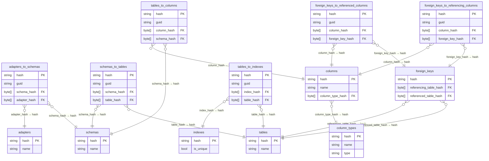

```mermaid
erDiagram

    adapters {
        string hash PK
        string name
    }

    adapters_to_schemas {
        string hash PK
        string guid
        byte[] schema_hash FK
        byte[] adapter_hash FK
    }

    schemas {
        string hash PK
        string name
    }

    schemas_to_tables {
        string hash PK
        string guid
        byte[] schema_hash FK
        byte[] table_hash FK
    }

    tables {
        string hash PK
        string name
    }

    tables_to_columns {
        string hash PK
        string guid
        byte[] column_hash FK
        byte[] schema_hash FK
    }

    columns {
        string hash PK
        string name
        byte[] column_type_hash FK
    }

    column_types {
        string hash PK
        string name
        string type
    }

    tables_to_indexes {
        string hash PK
        string guid
        byte[] index_hash FK
        byte[] table_hash FK
    }

    indexes {
        string hash PK
        bool is_unique
    }

    foreign_keys {
        string hash PK
        byte[] referencing_table_hash FK
        byte[] referenced_table_hash FK
    }

    foreign_keys_to_referenced_columns {
        string hash PK
        string guid
        byte[] column_hash FK
        byte[] foreign_key_hash FK
    }

    foreign_keys_to_referencing_columns {
        string hash PK
        string guid
        byte[] column_hash FK
        byte[] foreign_key_hash FK
    }

    adapters_to_schemas }o--|| adapters : "adapter_hash → hash"
    adapters_to_schemas }o--|| schemas : "schema_hash → hash"

    schemas_to_tables }o--|| schemas : "schema_hash → hash"
    schemas_to_tables }o--|| tables : "table_hash → hash"

    tables_to_columns }o--|| columns : "column_hash → hash"
    tables_to_columns }o--|| schemas : "schema_hash → hash"

    tables_to_indexes }o--|| indexes : "index_hash → hash"
    tables_to_indexes }o--|| tables : "table_hash → hash"

    columns }o--|| column_types : "column_type_hash → hash"

    foreign_keys }o--|| tables : "referencing_table_hash → hash"
    foreign_keys }o--|| tables : "referenced_table_hash → hash"

    foreign_keys_to_referenced_columns }o--|| columns : "column_hash → hash"
    foreign_keys_to_referenced_columns }o--|| foreign_keys : "foreign_key_hash → hash"

    foreign_keys_to_referencing_columns }o--|| columns : "column_hash → hash"
    foreign_keys_to_referencing_columns }o--|| foreign_keys : "foreign_key_hash → hash"

```
